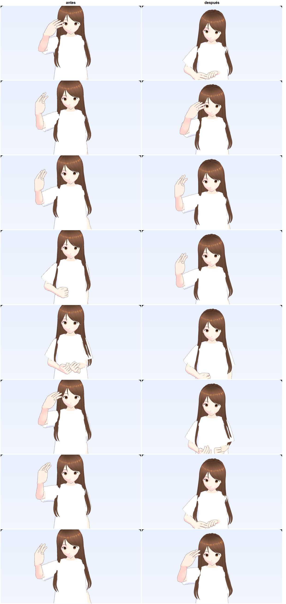
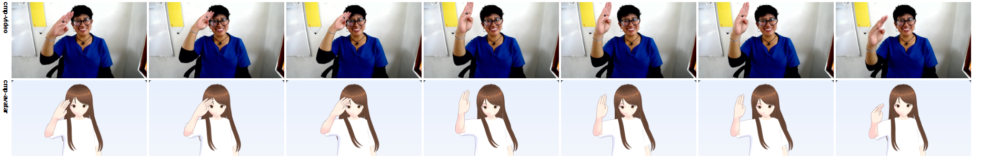
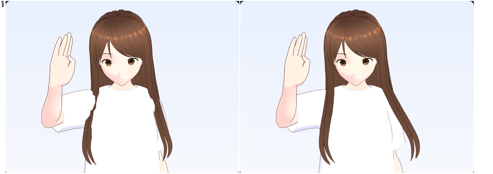
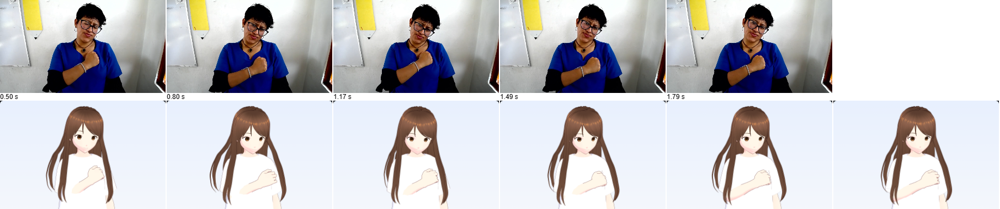
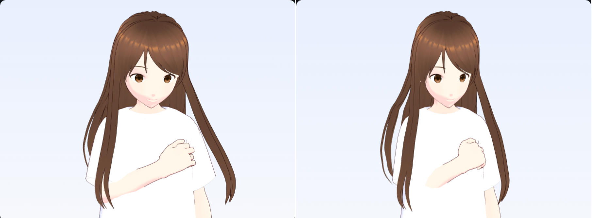
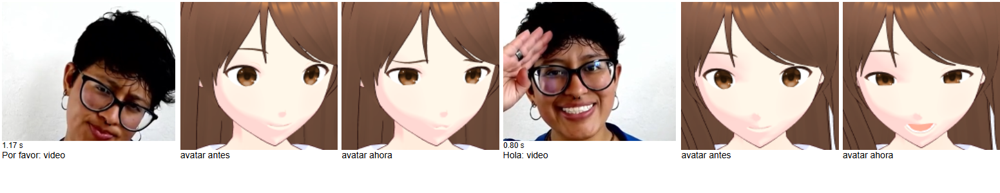
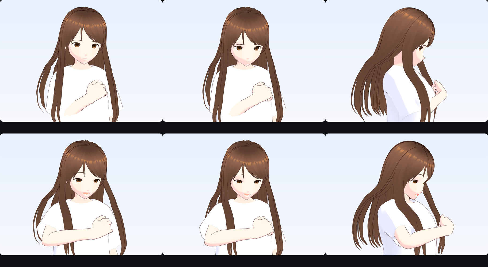
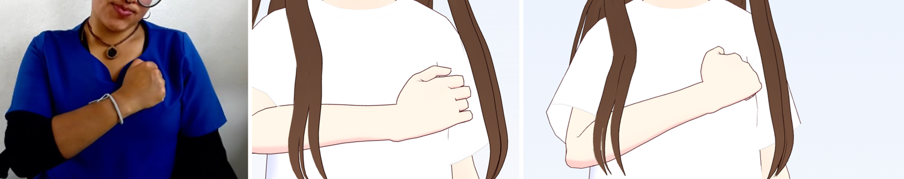

# Decisiones técnicas — Avatar 3D (mejora de «Hola»)

**Fecha:** 2026-09-16. Rama `feature/avatar-poc`. Continúa el formato de [DECISIONES-TECNICAS.md](DECISIONES-TECNICAS.md) (qué / por qué / descartado), numerado aparte con prefijo **A** para no chocar con D1–D28.

Registra cómo se revisó `docs/propuesta-avatar-lengua-senas.pdf` contra el código existente y qué se cambió para que «Hola» deje de verse trabado y pixelado antes de procesar las demás señas.

---

## Diagnóstico de partida

### A1. La propuesta del PDF ya estaba implementada en su arquitectura; lo que faltaba eran los pasos 3 y 4
**Qué:** VRM + `@pixiv/three-vrm`, MediaPipe Holistic en modo video y un JSON por seña ya existían (commits `4086caa`…`3341fc0`). Del PDF solo aportaban trabajo nuevo el paso 3 («normalizar y limpiar: smoothing, interpolar pérdidas, eliminar silencios») y el 4 («retargeting… guardar como cuaterniones y suavizarlos»), que el código no hacía o hacía a medias.
**Evidencia medida sobre `hola.landmarks.json` y `hola.mp4`, no supuesta:**
- El video fuente tiene ~31 fps (≈87 frames en 2.8 s, leído de la tabla `stts` del mp4). El JSON tenía **40 frames (~14 fps)**, con espaciado irregular (64 ms y 160 ms).
- El reproductor indexaba por `i / fps` ignorando `frame.t` → ritmo a tirones.
- La mano izquierda de la señante solo se detectaba en los últimos 7 frames (cuelga fuera de cuadro). El código rellenaba hacia atrás con la **última** detección: dedos congelados en una pose ajena al 80 % de la seña y brinco al final.
- Cero suavizado: el jitter de MediaPipe llegaba directo a los huesos.
- El bucle saltaba del último frame al primero sin transición.
- Render: `setPixelRatio(devicePixelRatio)` en un panel de 320 px; en pantallas 1× los dedos ocupan pocos píxeles y solo había MSAA. Encuadre fijo que cortaba la coronilla en paneles anchos. Las texturas del modelo se descartaron como causa: son de 1024–2048 px.

### A2. Alcance: pasos 1 (datos), 2 (limpieza) y 4 (render); el retargeting (paso 3) queda pendiente
**Por qué:** los tres son de bajo riesgo y atacan lo "trabado" y lo "pixelado". Lo que se "enciman" las articulaciones (mano que atraviesa el vientre, dedos que se cruzan) viene del retargeting por direcciones —sin giro del brazo, sin proporciones del avatar, sin abducción de dedos— y requiere IK; es un cambio más grande que conviene revisar aparte. Ver **Pendiente** al final.

---

## Paso 1 — Datos de entrada

### A3. Re-extracción a `playbackRate` 0.0625 (antes 0.15), expuesto como `--rate`
**Qué:** `extract-landmarks.mjs` acepta `--rate=` y usa 0.0625 por defecto. Hola pasa de 40 a **74 frames**, casi todos a 32 ms (la cadencia real del video), y ahora la mano izquierda aparece en 13 frames.
**Por qué:** la extracción muestrea con `requestVideoFrameCallback` durante reproducción real (los mp4 no permiten seek preciso, ver commit `12ff7d3`). La detección tarda ~230 ms por frame en CPU; a 0.15× cada frame del video dura ~213 ms reales, así que se perdía más de la mitad. A 0.0625× dura ~512 ms y casi todos alcanzan a procesarse.
**Por qué 0.0625 y no 0.05:** es el mínimo que acepta Chromium (0.05 lanza `NotSupportedError`).
**Costo asumido:** Hola tardó 1 min 52 s en extraerse (medido). Es aceptable para un proceso offline de 10 señas; para videos largos como el abecedario se puede seguir pasando `--rate=1`.
**Descartado:** pausar el video en cada frame y reanudar (más frágil: depende de latencias de play/pause del decodificador); decodificar con ffmpeg (no está instalado y agrega una dependencia nativa, ver el criterio de D10).

---

## Paso 2 — Limpieza de la animación (`apps/web/src/avatar/cleanup.ts`)

### A4. Se limpia en rotaciones de hueso, no en landmarks
**Qué:** primero se retargetea cada frame (como antes) y luego se limpia por hueso.
**Por qué:** los landmarks de mano vienen centrados en la mano; suavizar posiciones no evita que el ángulo de curl derivado salte, suavizar la rotación resultante sí. Además, así cada hueso tiene su propia pista con huecos explícitos, lo que hace simple el relleno (A5).
**Descartado:** suavizar landmarks antes de retargetear (dos pasadas de filtro para el mismo efecto y la de rotación seguiría siendo necesaria).

### A5. Relleno de huecos: interpolación si es corto, pose de reposo con rampa si es largo o está en un extremo
**Qué:** huecos interiores de ≤ 0.3 s → slerp por **tiempo real** entre detecciones vecinas. Huecos largos o en los extremos → pose de reposo (`restRotation` en `retarget.ts`: brazo abajo, dedos ligeramente flexionados), con rampa `smoothstep` de 0.25 s hacia y desde la detección más cercana.
**Por qué:** la mano izquierda de Hola cuelga fuera de cuadro; una mano relajada es lo que realmente hace la señante. La rampa evita el brinco al aparecer. 0.3 s cubre parpadeos de tracking sin inventar movimiento en pérdidas reales.
**Descartado:** mantener el relleno "último valor conocido" (causa directa del brinco).

### A6. Suavizado gaussiano centrado + remuestreo a 30 fps, en una sola pasada *(salida a 60 fps desde A18)*
**Qué:** para cada instante de salida (cada 1/30 s) se promedian las muestras cercanas con peso gaussiano sobre su tiempo real. σ = 35 ms para brazos, muñeca y cabeza; 50 ms para dedos (más ruidosos). Promedio de cuaterniones: suma ponderada normalizada con alineación de hemisferio.
**Por qué:**
- Tenemos el clip completo, así que el filtro puede ser **no causal** (mira hacia adelante y hacia atrás): quita jitter sin introducir retraso.
- Resolver jitter y espaciado irregular en la misma operación elimina el error de indexar por posición: en la prueba unitaria con un hueco de 64 ms, por índice se obtiene 28 ms de error y con el kernel menos de 10 ms.
- σ pequeños (≈1–1.5 frames) para no borrar movimientos rápidos, que en señas son significativos. Son parámetros nombrados en `DEFAULT_CLEANUP` para calibrarlos con otras señas.
- La suma normalizada de cuaterniones es válida porque el kernel abarca ±3σ ≈ ±0.15 s, donde las rotaciones son cercanas.
**Descartado:** filtro One-Euro, que sugiere la literatura de tracking. Es causal: está pensado para tiempo real y aquí solo agregaría retraso. SLERP/SQUAD sin suavizado: pasa por cada muestra ruidosa.
**Bug encontrado en el camino:** `new THREE.Vector4()` inicia en `(0,0,0,1)`, no en ceros. El acumulador sesgaba todo hacia la identidad (T-pose) y los brazos salían abiertos. Se inicializa explícito en ceros y quedó comentado.

### A7. Recorte de quietud relativo al pico del propio clip
**Qué:** se suma la velocidad angular de todos los huesos; los frames bajo el 10 % del pico al inicio y al final se recortan, dejando 0.12 s de margen.
**Por qué:** umbral relativo y no absoluto para no depender de la escala del ruido de cada video. En Hola casi no recorta (la seña empieza de inmediato y la quietud final coincide con la mano izquierda entrando en cuadro), pero queda listo para videos con silencios largos, como pide el PDF.

### A8. Cierre del bucle: transición de 0.45 s al primer frame y pausa de 0.2 s *(reemplazada por A18)*
**Qué:** al clip se le agregan frames que van de la última pose a la primera con `smoothstep`, y luego se mantiene la pose inicial 0.2 s. El reproductor envuelve de forma continua. Ciclo de Hola ≈ 3.4 s.
**Por qué:** elimina el golpe al repetir, y la breve pausa marca visualmente dónde empieza cada repetición. En Hola el inicio y el final ya son poses neutras, así que la transición es corta y natural.
**Descartado:** crossfade a una pose neutra genérica. Alarga el ciclo y agrega un movimiento que no está en el video.

---

## Paso 4 — Render (`apps/web/src/avatar/scene.ts`)

### A9. Supersampling: resolución interna de al menos 2×, tope en 3×
**Qué:** `setPixelRatio(min(max(devicePixelRatio, 2), 3))`, recalculado en cada `resize` (cambia al mover la ventana entre monitores o al hacer zoom).
**Por qué:** en pantallas 1× el canvas se dibuja a 2× y el navegador lo reduce promediando 2×2 píxeles. Eso quita el dentado de bordes de pelo, camisa y dedos. El costo es trivial en un panel de ~600×320. El tope en 3× evita disparar el costo en 4K.
**Descartado:** FXAA/SMAA con `EffectComposer`. Agrega un pipeline de postproceso y es un suavizado aproximado: difumina detalle fino, como las líneas de ojos y contornos de MToon, mientras que renderizar a mayor resolución lo conserva. A este tamaño de panel se puede pagar la opción exacta.

### A10. Encuadre por ajuste de caja según la proporción del panel
**Qué:** la cámara encuadra de la cintura (cadera + 20 % del torso) a la punta del pelo (caja del modelo en reposo + margen), con ancho mínimo de ±0.75 torsos para el espacio de señas. La distancia se recalcula con el aspecto del panel.
**Por qué:** el encuadre fijo cortaba la cabeza en paneles anchos. La coronilla se toma de la caja del modelo porque la estimación desde el hueso de la cabeza quedó 3 cm por debajo del pelo (medido: 1.587 m frente a 1.615 m).

### A11. Paso de física del pelo acotado a 1/20 s
**Qué:** `vrm.update(min(delta, 1/20))`.
**Por qué:** tras volver de una pestaña en segundo plano, el delta puede ser de segundos y los springbones del pelo salen disparados a través del cuerpo. Es una fuente de "cosas que se enciman" que no tiene que ver con la seña.

---

## Verificación

- `apps/web/test/avatar-cleanup.test.ts` (6 pruebas): interpolación por tiempo, rampa monótona a reposo, reducción de jitter, espaciado irregular, cierre de bucle sin brincos y recorte de quietud. Suite web: 14/14. `tsc -b` y `vite build` sin errores.
- Comparación visual con `tools/avatar/capture-frames.mjs` (nuevo): panel forzado a 320 px de alto y `deviceScaleFactor` 1, que es el peor caso de nitidez. La imagen de arriba se generó así.

La lista de pendientes de esta primera iteración (giro del brazo, proporciones con IK, dedos) se resolvió en la segunda iteración, abajo.

---

# Segunda iteración: retargeting (paso 3), pelo y seña breve

**Fecha:** 2026-09-16, después del merge de la primera iteración. Qué se pidió: que se vea "súper smooth" antes de seguir con otras señas. Los problemas señalados fueron tres: los dedos se mueven raro, las manos se traban al juntarse al final y el pelo atraviesa el cuerpo. Además, la animación debe ser breve, solo la seña.

## Retargeting (`retarget.ts`, `rig.ts`)

### A12. Medir el modelo en vez de suponer un rig ideal
**Qué:** `measureRig` lee, al cargar el modelo, la posición de cada articulación en reposo y la dirección real de cada hueso hacia su hijo. Para las falanges distales usa los nodos `_end` del VRM. Ese rig medido es la referencia de todas las rotaciones.
**Por qué:** el retargeting anterior suponía brazos exactamente en ±X y dedos rectos. En VRoid el pulgar sale en diagonal y los dedos van ligeramente abiertos. Calcular "de la dirección supuesta a la observada" metía esa diferencia como una rotación falsa en cada frame.

### A13. Brazos por posición de la muñeca + IK de dos huesos, no por direcciones
**Qué:** se toma la muñeca de la persona relativa a su hombro, se escala por el largo de brazo (avatar ÷ persona, mediana del clip) y se coloca relativa al hombro del avatar. El codo se resuelve con IK de dos huesos, usando el codo de la persona como polo.
**Por qué:** copiar solo direcciones respeta los ángulos pero no dónde termina la mano. El avatar tiene otras proporciones (cabeza grande, torso corto), así que la mano acababa dentro de la cara o del vientre. Se escala por largo de brazo, y no por ancho de hombros como sugiere el PDF, porque lo que hay que preservar es el alcance: una mano extendida debe seguir extendida, sin importar cuán anchos sean los hombros de cada quien.
**Costo asumido:** la mediana del largo de brazo depende de que la pose detecte bien hombro, codo y muñeca en la mayoría de los frames. En Hola la visibilidad del brazo derecho es ≥ 0.9.

### A14. Colisión mano–cuerpo contra la silueta medida
**Qué:** `measureBody` recorre los vértices de piel y ropa (con skinning aplicado) y guarda, por franjas de 2 cm de altura, el centro, el ancho y el fondo del torso y la cabeza como elipses. Antes del IK se prueban tres puntos de la mano (muñeca, nudillos y mitad de los dedos). Si alguno queda dentro, el objetivo de la muñeca se adelanta en +Z con 2.5 cm de holgura.
**Por qué:** es suficiente para que la mano no atraviese el pecho ni la frente (en Hola la mano toca la frente) sin integrar un motor de física. Se mide sobre la ropa y no sobre los colliders del modelo porque la camisa es holgada.
**Detalle:** los brazos en T-pose se excluyen por el hueso dominante de cada vértice (brazo o mano) y además con un tope lateral (hombro + 7 cm). Primero se intentó solo con el tope en la x del hombro y el torso salió de ±10 cm, cuando la camisa mide ±17 cm: la articulación del hombro queda por dentro de la camisa.

### A15. Giro del brazo por el plano del codo; pronación repartida 50/50
**Qué:** el brazo se orienta con la base (dirección del brazo, dirección en que dobla el antebrazo), así que su giro sobre el propio eje sale del plano hombro–codo–muñeca. Con el brazo casi recto ese plano no existe y se mezcla suavemente con el giro mínimo. La pronación/supinación que pide la mano se reparte: la mitad la gira el antebrazo y la otra mitad la muñeca.
**Por qué:** antes todo el giro lo absorbía la muñeca y la malla se torcía como envoltura de caramelo. Sin huesos de giro en el antebrazo (VRM no los tiene), repartir 50/50 es el compromiso estándar.

### A16. Dedos con límites anatómicos; pulgar por dirección observada
**Qué:** cada falange se expresa en el marco de su hueso padre y se descompone en flexión (hacia la palma) y abducción (lateral). Se limita cada una: base −0.25…1.6 rad y ±0.3 de abducción; media 0…1.9; distal 0…1.4; sin abducción fuera de la base. El pulgar sigue la dirección observada de cada falange con un tope de 1.1 rad.
**Por qué:** antes se usaba solo el ángulo entre segmentos, alrededor de un eje fijo, sin abducción y con el pulgar en un eje supuesto. El ruido de profundidad de MediaPipe se convertía en dedos doblados hacia atrás o cruzados; los límites cortan exactamente esos casos. El pulgar no se restringe a una bisagra porque su eje de flexión es oblicuo y distinto entre personas.
**Verificado:** en el recorte de la mano a 1.3 s coincide con el video (tres dedos arriba, meñique doblado contra el pulgar).

### A17. Solo la seña: tramo explícito por seña (Hola: 0.15–1.8 s)
**Qué:** `animations.ts` registra por seña el tramo del video que es la seña. El suavizado se calcula con todo el video y el corte se aplica después. El brazo cuya mano nunca aparece en el tramo (aquí el izquierdo, en el regazo) va en reposo todo el clip.
**Por qué:**
- **Tramo elegido a mano:** viendo el video cuadro por cuadro, de 1.9 a 2.8 s la señante solo baja las manos y las entrelaza. Eso era el "se traban al juntarse" y no es parte de la seña. Qué es la seña es una decisión lingüística, no un umbral de movimiento, así que se registra explícito y se revisa con ICAL.
- **Cortar después de suavizar:** si se corta antes, el filtro ve un solo lado en el borde y deforma el arranque. Medido: el tirón máximo del brazo estaba en 0.07 s.
- **Por qué 0.15 s:** el video empieza con la mano ya en movimiento y antes de 0.05 s no hay datos.
- **Brazo en reposo:** una mano fuera de cuadro hace que la pose estime el brazo a ciegas; quedaba flotando frente al vientre.
**Ciclo resultante:** 2.05 s, frente a 3.4 s antes.
**El mismo tramo define la plantilla de reconocimiento** (D29 en DECISIONES-TECNICAS.md): una sola fuente de verdad de qué es la seña.

### A18. Cierre del bucle que conserva la velocidad, y salida a 60 fps
**Qué:** la transición de regreso (0.4 s, sin pausa) mezcla con `smoothstep` dos cosas: la continuación del final de la seña, con su velocidad apagándose en ~0.1 s, y la anticipación del inicio, que llega con la velocidad con que arranca la seña. La animación limpia se muestrea a 60 fps en vez de 30.
**Por qué:** un slerp directo entre la última y la primera pose arranca y termina con velocidad cero. Junto con la pausa, eso se sentía como un frenón en cada repetición. Con muestras a 30 fps, además, la velocidad cambiaba de golpe en cada muestra.
**Medido** con `tools/avatar/measure-smoothness.mjs` (nuevo), aceleración angular máxima en rad/s², comparando la primera versión de este retargeting (cierre anterior, 30 fps, corte antes de suavizar) con la final:

| Hueso | Antes | Después |
|---|---|---|
| Brazo | 553 | 149 |
| Meñique (base) | 460 | 136 |
| Índice (base) | 294 | 124 |
| Cabeza | 212 | 48 |

La prueba unitaria de continuidad del bucle falla si se vuelve al slerp directo (verificado).

## Pelo (`rig.ts: addHairColliders`)

### A19. Colliders de pelo que siguen la silueta de la ropa
**Qué:** con el mismo perfil de A14 se colocan esferas de 3 cm apoyadas por dentro de la superficie, al frente y atrás del torso, cada ~4 cm, y se agregan a las articulaciones del pelo. Las cápsulas de brazo del modelo se engrosan 1.8× solo para el pelo, porque las mangas son holgadas.
**Por qué:** los colliders del modelo cubren columna, pecho alto, cuello, cabeza y brazos, pero no hombros ni el frente del pecho con la camisa. Por ahí el pelo largo se metía en la tela (se veían cortes dentados en los hombros).
**Descartado:** cápsulas horizontales con el radio del fondo del torso. Sobresalen por arriba del hombro y dejan el pelo flotando.
**Límite conocido:** la física de three-vrm solo corrige la punta de cada segmento de pelo, así que puede quedar algún cruce leve a mitad de segmento. En las capturas no se ve.

## Verificación de la segunda iteración

- **Pruebas nuevas:**
  - `avatar-retarget.test.ts`: IK (alcance y largo de segmentos, polo, objetivo fuera de alcance) y colisión (empuje, puntos afuera, sección elíptica).
  - `avatar-cleanup.test.ts`, dos más: bucle con velocidad continua y tramo aplicado después de suavizar.
  - Suite web: 21/21. `tsc -b`, `oxlint` y `vite build` sin errores nuevos.
- **Revisión cuadro por cuadro:** `/avatar-poc?t=1.2` congela la seña, y `capture-frames.mjs --tiempos=...` lo usa.

## Pendiente

1. **Validación con ICAL** del tramo elegido (A17) y de la configuración manual. La imagen de arriba sirve para esa revisión.
2. **Expresión facial:** no se transfiere (PDF, fase posterior). *Resuelto en A27.*
3. **Mano con mano:** no hay colisión entre las dos manos. Hola no la necesita; señas donde las manos se tocan sí.

---

# Tercera iteración: Por favor (2026-09-17)

Primera seña después de Hola. El objetivo era repetir el proceso tal cual, pero la seña sacó a la luz cuatro problemas que Hola no tenía: el pulgar separado del puño, un giro falso de muñeca, el pelo atrapado por el brazo y el pelo rígido al inclinar la cabeza. Se corrigieron en el pipeline, así que también benefician a Hola y a las señas siguientes.

## Receta para una seña nueva

> **Versión vigente:** la skill `.claude/skills/avatar-sena/SKILL.md` (sexta iteración). Agrega la configuración manual, la lista de control de calidad y la tabla de problemas ya resueltos. Esta sección conserva los pasos originales y los comandos de la plantilla de reconocimiento (pasos 5 y 6).

Es el proceso seguido con Por favor. Hay que cambiar el slug, el `signId` y los tiempos.

1. **Ver la seña:** `node tools/avatar/video-sheet.mjs content/ical-2026-09/<slug>.mp4 hoja.png --cada=0.1`. Para acercar la mano: `--recorte=x,y,w,h --desde --hasta --ancho`. Decidir el tramo que es la seña (sin preparación ni regreso a reposo) y anotar qué se ve: mano dominante, configuración, contacto, movimiento, gestos no manuales.
2. **Extraer landmarks:** `node tools/avatar/extract-landmarks.mjs content/ical-2026-09/<slug>.mp4 apps/web/public/avatar/<slug>.landmarks.json` (~2 min). Revisar en qué frames se detectó cada mano.
3. **Registrar la seña** en `apps/web/src/avatar/animations.ts`, con `gloss`, `url`, `window` y `face` (gestos no manuales, A27), y un comentario de por qué ese tramo y esa cara. Con eso la lección ya muestra el avatar.
4. **Revisar el avatar** en `/avatar-poc?sena=<signId>`:
   - `&t=` congela la seña en un instante;
   - `&angulo=70` la muestra de lado (contactos con el cuerpo);
   - `capture-frames.mjs --tiempos=...` saca cuadros a comparar con la hoja del video;
   - `measure-smoothness.mjs "<url>?sena=<signId>"` busca tirones (maxAcc aislados).
5. **Plantilla de reconocimiento:** `npx vite-node tools/content/build-templates.mjs courtesy --only <todas las señas ya revisadas>`. `--only` reemplaza el bundle, así que hay que listar también las anteriores.
6. **Verificar:**
   - `npx vite-node tools/content/verify-template.mjs <signId>`: su video a varias velocidades, sin falsos positivos contra las otras 9.
   - `npx vite-node tools/content/diagnose-practice.mjs <signId>`: detector real de la app, cámaras 16:9 y 4:3. Hay que registrar el video en su mapa `VIDEOS`.
   - `JITTER=0.003 npx vite-node tools/content/tune-motion.mjs 0.5:0.4:0.6`: que la mano quieta y la seña hecha en otro lugar no validen, que la real sí, y sin falsos positivos (D36, D37). Si la seña nueva rompe algo, comparar otras combinaciones de peso, fracción y tolerancia.
7. **Probar con la cámara** en la lección, y **documentar** aquí lo que la seña haya enseñado.

## A20. Tramo de Por favor: solo el contacto (0.37–2.06 s)
**Qué:** puño derecho apoyado en el lado izquierdo del pecho, con círculos pequeños. Antes de 0.37 s la mano sube desde el reposo; después de 2.06 s se retira y las manos se entrelazan.
**Por qué:** si el tramo es solo el contacto, el cierre del bucle (A18) va de círculo a círculo sin despegar la mano del pecho. Si incluyera la subida, cada repetición despegaría la mano y volvería a subir, algo que no es parte de la seña.
**No transferido:** la cabeza inclinada sí pasa al avatar (retargeting de cabeza), pero el gesto de súplica de la cara no. Es parte de la seña y queda como pendiente. *Resuelto en A27.*

## A21. El rig se mide completo al cargar, no a demanda
**Qué:** `measureRig` lee de una vez, con el modelo en reposo, la posición de todos los huesos humanoides y de los nodos `_end`.
**Por qué:** antes las posiciones se leían la primera vez que se pedían. Cualquier lectura posterior (otra seña, una herramienta de revisión) obtenía la pose animada como si fuera reposo. En la depuración de Por favor, la falange distal del pulgar derecho apuntaba al revés (+X). En la app no llegaba a pasar porque el reproductor se crea antes de animar, pero era una trampa latente.

## A22. Contacto del pulgar preservado con IK
**Qué:** si en el video la punta del pulgar está a menos de 0.45 largos de mano de algún punto de los dedos (PIP, DIP o yema), se toma ese mismo punto en la mano del avatar, se le suma el desplazamiento observado escalado, y se resuelve con CCD sobre metacarpo y falange proximal. El peso se apaga con `smoothstep` entre 0.45 y 0.30, para no forzar contactos que no existen.
**Por qué:** copiar la dirección de cada falange no basta. El pulgar de VRoid es más largo y nace en otro punto, así que con las mismas direcciones su punta quedaba separada del puño.
**Medido:** separación en largos de mano, avatar / video.
- **Por favor** (pulgar a PIP del índice, t = 1.33 s): antes 0.49 / 0.32, después 0.30 / 0.32. En los demás instantes medidos quedó a ±0.07 del video.
- **Hola** (pulgar al punto más cercano de los dedos, solo después del cambio): entre −0.03 y +0.11 del video, por ejemplo 0.43 / 0.46 a 1.3 s y 0.50 / 0.39 a 1.5 s.

**Detalle:** las yemas se agregaron como candidatas después de medir Hola, donde el pulgar toca la punta del meñique y no un nudillo.

## A23. Detecciones de mano implausibles se descartan
**Qué:** se calcula la mediana, en todo el clip, del ancho entre los nudillos del índice y del meñique (landmarks 5 y 17). Si en un frame ese ancho baja del 80% de la mediana, esa mano (y el giro del antebrazo, que sale de ella) cuenta como no detectada, y la limpieza la interpola con los vecinos.
**Por qué:** el ancho de la mano de una persona no cambia. En Por favor, MediaPipe "encogió" el puño de 6.5 a 4.6 cm en un frame, con un giro falso de 24° que se veía como un latigazo de la muñeca.
**Resultado:**

| Hueso | Aceleración máx. antes | Después |
|---|---|---|
| Muñeca | 315 rad/s² | 237 rad/s² |
| Antebrazo | 54 rad/s² | 42 rad/s² |

El giro que queda es continuo (≤ 6° por frame) y el video también muestra rotación del puño en ese tramo.

## A24. La física del pelo se asienta antes del primer render
**Qué:** al cargar se simula ~2.1 s sin mostrar nada: brazos en reposo con el pelo reiniciado (1 s), entrada gradual a la pose inicial de la seña (0.6 s) y asentamiento (0.5 s). Para eso, `SignPlayer.update` acepta un peso de mezcla con el reposo.
**Por qué:** el brazo saltaba en un frame de la T-pose a la seña y atravesaba los mechones, que quedaban atrapados del lado equivocado de los colliders del antebrazo. En Por favor el mechón quedaba flotando por fuera del brazo, y distinto en cada carga, porque dependía de por dónde se atrapara. Con la pose congelada el pelo no oscilaba (0.00 cm por frame), lo que descartó la inestabilidad. Tras el cambio, tres cargas seguidas dan la misma imagen.

## A25. Más gravedad en los mechones largos, no en el flequillo
**Qué:** `gravityPower` mínimo de 0.3 en `J_Sec_Hair*_05..12`. Medido en este modelo: `_01..04` son el flequillo corto, `_05..10` el pelo de atrás y `_11/_12` los dos mechones largos del frente. Ese pelo trae 0.1 (atrás) y 0 (frente), con rigidez 0.5.
**Por qué:** con tan poca gravedad el mechón conserva su forma respecto a la cabeza. Al inclinarla (Por favor) giraba entero y quedaba en diagonal. Se compararon 0.1, 0.3, 0.6 y 1.0 en Hola y en Por favor: 0.3 hace caer el pelo sin aplastarlo, y aplicarlo también al flequillo lo tiraba sobre los ojos.
**Tropiezo:** la primera versión escribió el regex sin barras invertidas y no afectaba a ningún mechón. Se detectó midiendo la gravedad efectiva de cada mechón en la página, no mirando capturas.

## A26. Revisión con vista lateral y selector de seña
**Qué:** `/avatar-poc?sena=<signId>&t=<s>&angulo=<grados>` elige la seña, la congela y gira la cámara (`AvatarScene.setCameraYaw`).
**Por qué:** de frente no se distingue si una mano toca el cuerpo o flota delante. Con `angulo=70` se confirmó que el puño de Por favor toca la camisa sin atravesarla. Queda para revisar cualquier seña con contacto.

## Verificación de la tercera iteración
- **Pruebas:** web 25/25 (nuevas: descarte de manos implausibles). cv-model 35/35. `tsc -b` y `vite build` sin errores.
- **Suavidad** (`measure-smoothness`): Por favor tiene un ciclo de 2.08 s; brazo 70, antebrazo 42 y dedos ≤ 142 rad/s². Hola no cambió respecto a A18.
- **e2e:** no se pudo correr porque el puerto 3001 ya estaba ocupado. Esta iteración no toca el flujo que cubre.
- **Pendiente nuevo:** la limitación del reconocimiento que expone Por favor, en D35 de DECISIONES-TECNICAS.md.

---

# Cuarta iteración: gestos no manuales (2026-09-18)

La cara de súplica de Por favor es parte de la seña (A20) y el avatar la hacía con cara neutra. Hola, que se hace sonriendo, tampoco tenía expresión.

## A27. Expresión de la cara registrada por seña, no extraída del video
**Qué:** `animations.ts` registra por seña una expresión (`face`) como pesos de los morphs de cara del modelo VRoid (`Fcl_BRW_*`, `Fcl_EYE_*`, `Fcl_MTH_*`). `face.ts` la registra como una expresión VRM propia y el reproductor la aplica con el mismo peso de mezcla que los huesos, así que entra gradual al cargar (A24).
- **Por favor:** cejas levantadas por dentro y juntas (`BRW_Sorrow` 0.8 + `BRW_Angry` 0.3), ojos entrecerrados (`EYE_Sorrow` 0.6), labios apretados en puchero (`MTH_Angry` 0.6 + `MTH_Small` 0.4). *Reemplazada por la sonrisa de Hola en A29.*
- **Hola:** sonrisa abierta (`MTH_Joy` 0.5, `EYE_Joy` 0.35, `BRW_Joy` 0.5).

**Por qué no se extrae:** fue lo primero que se probó. Holistic entrega los 52 coeficientes de ARKit (`outputFaceBlendshapes`). En el video de Por favor, medidos:
- `mouthSmile` ≈ 0.6 durante el puchero, cuando la sonrisa real de después del tramo da 0.9. Transferido, el avatar sonreía mientras suplicaba.
- El puchero no aparece: `mouthPucker` ≤ 0.09, `mouthFrown` 0.
- El ceño apenas: `browInnerUp` 0.05–0.19, `browDown` < 0.1.

La cabeza inclinada y los lentes probablemente confunden al modelo. Con una sola señante no hay cómo calibrarlo, y una expresión equivocada es peor que ninguna. Qué cara lleva la seña es, además, una decisión lingüística como el tramo (A17): se registra explícita, con un comentario de qué se ve en el video, y se revisa con ICAL.

**Por qué morphs y no las expresiones del modelo:** las del modelo (`sad`, `happy`…) son de cara completa (`Fcl_ALL_*`). No permiten, por ejemplo, cejas de tristeza con boca apretada, que es la súplica. Los pesos se eligieron comparando capturas de la cara del avatar con la hoja del video (`video-sheet.mjs --recorte`).

**Descartado:** mapear los coeficientes a morphs restando la cara neutra de la persona. En este video no hay un tramo neutro fiable (antes de la seña ya empieza el gesto) y el problema de fondo es que el puchero no se detecta.

## A28. Parpadeo en el cierre del bucle
**Qué:** cada dos ciclos (~4 s) el avatar parpadea (cierre de 60 ms, apertura de 100 ms) en medio del regreso al inicio, nunca durante la seña. Sobre ojos ya entrecerrados el parpadeo se reduce (0.3 × el peso de los morphs de ojos) para que el párpado no se pase.
**Por qué:** sin parpadeo la cara se ve congelada, más ahora que tiene expresión. Se pone en el límite entre repeticiones porque es donde parpadea una persona señante; a mitad de la seña se podría leer como parte de ella. Es determinista (depende del ciclo, no de un reloj al azar), así que las capturas con `?t=` siguen siendo reproducibles: el ciclo 0 nunca parpadea.
**Verificado:** con Por favor la reducción inicial de 0.6 dejaba ver una rendija en el parpadeo; con 0.3 cierra limpio en ambas señas.

## Verificación de la cuarta iteración
- **Pruebas:** `avatar-face.test.ts` (parpadeo solo en el regreso, cierre completo, ciclos alternos; `returnStartFrame` del clip).
- **Receta:** el paso 1 de la receta ya pide anotar los gestos no manuales; ahora se registran en `face` (paso 3).

---

# Quinta iteración: pulido de Por favor (2026-09-21)

Pedido: que Por favor no se vea triste, sino con la misma cara que Hola, y que deje de atravesarse a sí misma (brazo dentro de la camiseta, pelo a través del puño).

## A29. Por favor con la sonrisa de Hola, no con la cara de súplica
**Qué:** `face` de Por favor pasa a los mismos pesos que Hola (`MTH_Joy` 0.5, `EYE_Joy` 0.35, `BRW_Joy` 0.5).
**Por qué:** la súplica de A27 (cejas de tristeza, ojos entrecerrados, puchero) describe el video, pero en este modelo, junto con la cabeza inclinada, se leía como tristeza y no como cortesía. Se compararon cuatro variantes con la cara de Hola al lado: la misma sonrisa de Hola, sonrisa cerrada (`MTH_Fun`), sonrisa cerrada con cejas levantadas por dentro, y una mezcla. Se eligió la misma de Hola para que las dos señas de cortesía tengan una cara coherente.
**Pendiente:** confirmar con ICAL si el gesto no manual de súplica es obligatorio en la seña. Si lo es, conviene buscar una versión suave (cejas levantadas por dentro con sonrisa) en vez del puchero.

## A30. Colisión de todo el brazo: giro del codo antes que adelantar la mano
**Qué:** `solveArmClearance` (retarget.ts) reemplaza el empuje de la mano de A14. Prueba puntos del brazo (último cuarto), del antebrazo y de la mano contra la silueta medida, y busca dos correcciones: girar el codo alrededor del eje hombro–muñeca (la mano no se mueve) y adelantar la muñeca. Elige la de menor costo entre penetración y distancia a la pose observada. La búsqueda es en rejilla gruesa y luego fina.
**Por qué:** A14 solo probaba la mano. En Por favor (puño en el pecho del lado contrario) el codo quedaba **12 cm dentro del torso**, medido con la silueta, y el antebrazo salía de la camiseta. Adelantar la mano no lo arreglaba sin despegar el puño del pecho. Girar el codo sí lo arregla y deja el contacto intacto, por eso cuesta menos.
**Tropiezos medidos:**
- Con el giro barato y el brazo probado desde su mitad, el óptimo subía el codo a la altura del hombro (codo de "ala de pollo"). La mitad del brazo junto al hombro está siempre "dentro" de la camisa holgada, también en reposo. Ahora solo se prueba el último cuarto, y el giro cuesta 5× más.
- `bodyPenetration` mide la profundidad dentro de la elipse sin suponer que la salida es por el frente, como hacía `forwardPushOut` (que se eliminó). Si no, un codo que sale por el costado se veía como si siguiera adentro.

**Resultado:** penetración máxima del brazo en el ciclo de 0.12 m a ≤ 0.011 m, que es el roce de la manga con el costado. Hola no cambia a simple vista (se revisó a 0.3, 0.8 y 1.3 s).

## A31. La mano se prueba con sus dedos reales, y el pelo choca con toda la mano
**Qué:**
- Los dedos se retargetean antes que el brazo. Su pose no depende del codo, porque la mano termina con la orientación observada. La colisión prueba nudillos, articulaciones y yemas donde de verdad quedan, con 1.2 cm de holgura; la muñeca conserva 2.5 cm.
- Se agregan esferas de colisión del pelo en palma, nudillos y dedo medio de cada mano (`handColliders` en rig.ts). El modelo solo traía una esfera de 3 cm en la muñeca.

**Por qué:** la prueba de A14 suponía los dedos extendidos al frente. En un puño apuntan hacia el pecho, así que los dedos se metían en la camisa y en el mechón largo del frente, que parecía pasar por en medio del puño. Con 2.5 cm de holgura en los dedos el puño quedaba flotando frente al pecho; con 1.2 cm las yemas quedan apoyadas sobre el mechón, que pasa por detrás del puño como pasaría en una persona.

## Verificación de la quinta iteración
- **Pruebas:** `avatar-retarget.test.ts` reemplaza las de `forwardPushOut` por `bodyPenetration` y agrega `solveArmClearance`: saca el antebrazo del torso sin mover la mano, adelanta la mano si sus puntos están adentro y no toca un brazo que ya está afuera. Las 21 pruebas de avatar pasan; `tsc -b` y `oxlint` sin errores nuevos.
- **Suavidad** (`measure-smoothness`), aceleración máxima en rad/s²:
  - Por favor: brazo 48 (antes 70), antebrazo 54 (antes 42), muñeca 243 (antes 237), dedos ≤ 142. Sin tirones aislados.
  - Hola: igual que en A18 (brazo 149).

---

# Sexta iteración: Por favor natural y receta para las demás señas (2026-09-22)

Pedido: el puño no se veía cerrado y el movimiento todavía no parecía natural. Además, que todo lo aprendido quede documentado para hacer las señas siguientes sin rehacerlo. La receta vigente quedó en la skill `.claude/skills/avatar-sena/SKILL.md`.

## A32. Configuración manual registrada por seña (puño) y pulgar del puño
**Qué:**
- `animations.ts` acepta `handshape: { right: 'puño' }`. `HANDSHAPE_FLEX` (retarget.ts) fija la flexión de los cuatro dedos (base 1.5, media 1.75, distal 1.05 rad) con abducción cero, en lugar de la observada.
- Con configuración registrada, el pulgar va al costado del índice, a la altura de su falange media (configuración A, la del video), con IK sobre sus tres falanges (`handshapeThumbTarget`).

**Por qué:** en un puño contra el pecho los dedos quedan ocultos. MediaPipe los daba a medio doblar y el avatar mostraba un gancho abierto. El pulgar salía levantado, porque en el puño su yema queda lejos de las articulaciones que usa la preservación de contacto (A22). Igual que el tramo y la cara, la configuración es una decisión lingüística: se registra con un comentario de qué se ve en el video y se revisa con ICAL.
**Descartado:** mezclar lo observado con el puño. La detección de dedos ocultos no aporta información, solo ruido.

## A33. El hombro acompaña al brazo que cruza el cuerpo
**Qué:** `shoulderGirdle` gira el hueso del hombro hacia el frente (hasta 25°) y hacia abajo (hasta 10°), según cuánto cruza la mano al lado contrario (de 5 a 20 cm desde el hombro, con `smoothstep`). El IK parte del hombro desplazado. El objetivo de la mano no cambia, así que el contacto se conserva.
**Por qué:** con el hombro fijo, el avatar no tenía alcance para bajar el codo sin meterlo en el torso. `solveArmClearance` lo resolvía subiendo el codo, y el antebrazo quedaba horizontal. En el video el codo cuelga y el antebrazo sube en diagonal, porque una persona adelanta el hombro al llevar la mano al pecho contrario. Barrido medido (inclinación del antebrazo):

| Adelantamiento / descenso | 0° / 0° | 10° / 10° | 20° / 10° | 30° / 10° |
|---|---|---|---|---|
| Antebrazo | 11° | 20° | 24° | 30° |

Se eligió 25° / 10°, dentro del rango anatómico de la clavícula. Hola no cruza el cuerpo y no cambia.
**Efecto en el pelo:** con el codo más bajo, el mechón derecho atravesaba el codo. Por eso la holgura del antebrazo pasa de 3 a 4 cm (espacio para el mechón entre el antebrazo y el pecho) y la cápsula del antebrazo para el pelo se engrosa 1.4×. Ahora el mechón cae limpio sobre el antebrazo.

## A34. Respiración y colliders que de verdad siguen al cuerpo
**Qué:**
- El pecho (`upperChest`) se inclina hasta 0.7° con un ciclo de 3.6 s (`breathing`). Depende del tiempo absoluto, no del ciclo de la seña: no salta al repetir, y con `?t=` queda fijo.
- **Bug corregido:** `addHairColliders` llama a `manager.addJoint(first)` al final.

**Por qué:**
- Con todo el torso inmóvil, el avatar se veía como maniquí aunque las manos se movieran bien.
- Al verificar que los colliders del torso siguieran la respiración, se midió que **no se movían**. three-vrm solo actualiza cada frame la matriz de los colliders que existían cuando ordenó las articulaciones, al cargar. Los agregados después quedaban congelados en la pose de reposo. Las esferas de mano de A31 se habían quedado en la T-pose, a los lados del cuerpo, y no hacían nada: lo que había mejorado el pelo en A31 era haber adelantado la mano. `addJoint` con una articulación existente es idempotente y marca el orden como sucio. Medido después del cambio: la esfera de la palma queda a 3 cm de la muñeca y se mueve con ella.

## Herramientas nuevas
- `tools/avatar/check-contacts.mjs "<url>" [--lado=] [--cada=]`: penetración del brazo y del antebrazo en el cuerpo por instante, con las holguras del retargeting. Por favor: máximo 0.000 m (antes de A30, 0.12 m).
- `capture-frames.mjs --recorte=x,y,w,h`: recorta en fracciones del canvas, para revisar la mano de cerca con `--escala=3`.

## Verificación de la sexta iteración
- **Pruebas:** 25 de avatar (nuevas: `shoulderGirdle` y `breathing`). `tsc -b` y `oxlint` sin errores.
- **Suavidad**, aceleración máxima en rad/s²:
  - Por favor: brazo 119, antebrazo 39, muñeca 241, pulgar ≤ 132. Los dedos largos quedan en 0 porque el puño es fijo.
  - Hola: igual que antes (brazo 149).
- **Visual:** frente, ±45°, ±70° y diez cuadros en movimiento. Puño cerrado con el pulgar al costado del índice, antebrazo en diagonal, mechón sobre el antebrazo y detrás del puño, sin cruces. Hola: igual a 0.3, 0.8 y 1.3 s.

---

# Séptima iteración: Gracias, la primera seña con contacto en la cara y dos manos (2026-09-22)

Pedido: llevar al avatar la seña Gracias. En el video, la mano derecha plana toca
los labios y el mentón (0.6–1.17 s), baja al frente girando la palma hacia arriba
y se apoya con el dorso sobre la palma izquierda, también plana y hacia arriba
(1.45–1.97 s). Es la primera seña con **contacto en la cara** y la primera con
**las dos manos encimadas**: las dos cosas rompen supuestos del retargeting, no
por el modelo, sino porque MediaPipe no da esos datos.

## A35. Contacto registrado con la cara: la yema se apoya en la piel medida

**Qué:**
- `animations.ts` acepta `faceContact: { right: [0.6, 1.17] }`: el tramo del
  video en que la yema del dedo medio toca la cara. En él, el objetivo de la
  muñeca no sale de la posición observada, sino de dónde queda la yema: se
  conserva lo que MediaPipe sí acierta —dónde está la yema respecto a la boca en
  el plano de la cara, escalado— y la profundidad se toma de la **piel del
  modelo** más el radio del dedo.
- `rig.ts` mide esa piel: `FaceProfile` guarda el centro de la boca (los
  vértices que mueve el morph `*Fcl_MTH_A`) y una rejilla de 5 mm con la z más
  adelantada de la cara alrededor de ella. Todo en el marco de la cabeza, que
  gira con la seña.
- La mano gira **alrededor de la yema** (inclinación en x, la muñeca hacia el
  frente) y esa inclinación se elige junto con el brazo, por el costo total de
  `solveArmClearance` (que ahora devuelve su costo) más el de inclinar.
- Con contacto, la mano no se adelanta (`maxPush` a 0) y de la mano solo se
  prueba la muñeca contra el cuerpo.

**Por qué (medido en el video y en el avatar):**
- **La profundidad de MediaPipe no sirve cerca de la cara.** En los landmarks de
  gracias.mp4 la yema queda a 0–5 cm de la boca en x/y (el mentón), pero de
  13 a 17 cm **por delante**. El avatar dejaba la mano flotando a un palmo de la
  cara: se ve en la vista de lado, no de frente.
- **La silueta del cuerpo no sirve para apoyar la yema.** `BodyProfile` toma el
  envolvente de las franjas vecinas, así que a la altura de los labios ya
  incluye la nariz, 1.5 cm más adelante. Por eso la cara se mide aparte, y por
  eso con contacto los dedos no entran a la prueba de colisión.
- **Adelantar la mano (A30) despega el contacto:** la yema quedaba a 7 cm de los
  labios porque la muñeca rozaba la camisa y `solveArmClearance` empujaba.
- **La orientación observada de la mano también está torcida:** con la yema en
  los labios dejaba la muñeca contra el cuello y el antebrazo 13 cm dentro del
  torso. Una persona apoya la yema y deja la muñeca delante del mentón; de ahí
  el giro alrededor de la yema. Primero se probó "inclinar lo mínimo para sacar
  la muñeca del cuerpo", y la inclinación se saturaba en el tope mientras el
  antebrazo seguía atravesando el pecho y el codo subía a la altura del hombro.
  Elegir inclinación y brazo juntos lo arregla.
- **El contacto dura lo que la yema está en la cara**, no un tramo de tiempo: se
  pesa por la distancia de la yema a la boca en el plano de la imagen (pleno a
  6 cm, nada a 15 cm). Con una rampa de tiempo, al soltar, la muñeca bajaba por
  delante del pecho conservando la profundidad del contacto y el codo subía y
  bajaba 5 cm (tirón de 398 rad/s² en el brazo).
- **El polo del codo se mide desde el objetivo corregido.** Desde el observado,
  el codo quedaba "detrás" de la mano, dentro del torso. Sin contacto es el
  mismo objetivo, así que Hola y Por favor no cambian.

**Medido (Gracias, tramo del contacto):** la yema queda a 0.6–1.4 cm de la piel
(el radio del dedo es 1.2 cm) en todo el contacto, frente a 13–17 cm antes.
Penetración máxima del brazo derecho: 0.001 m.

## A36. Lo que MediaPipe no ve de dos manos encimadas se registra: palma arriba

**Qué:**
- `animations.ts` acepta `palmUp: { left: [1.42, 2.0], right: [1.42, 2.0] }`.
  En ese tramo **no se usa la detección de la mano**: la palma va hacia arriba y
  los dedos siguen al antebrazo (del codo a la muñeca de la pose, en horizontal).
- `handshape` acepta `plana` (dedos juntos y casi rectos: 0.08 / 0.06 / 0.04 rad).
  Con configuración registrada, el pulgar parte del reposo en vez de lo
  observado.
- El giro del antebrazo se elige en el rango anatómico (`supinationAngle`):
  la pronación llega a ~90° y la supinación pasa de 180°.

**Por qué (medido):**
- **Con las manos encimadas la detección es basura:** el ancho entre nudillos
  cae a 1–4 cm (el real es 6.5) y la normal de la palma se voltea de un frame a
  otro. El filtro de manos implausibles (A23) descartaba casi todos los frames
  de la mano derecha, y como el hueco llega al final del tramo, la limpieza
  (A5) la mandaba al reposo: la mano terminaba colgando al costado en vez de
  sobre la palma izquierda. La pose del cuerpo sí es estable ahí (visibilidad
  0.92–0.97), y el antebrazo da hacia dónde apuntan los dedos.
- **Palma arriba es ~180° de supinación**, justo donde la descomposición
  swing-twist da +180° o −180° según el ruido. Repartido 50/50 con la muñeca
  (A15), el antebrazo saltaba de +90° a −90°: **17774 rad/s² en la mano
  izquierda**. Con el rango anatómico, 185.
- **Mano plana:** MediaPipe daba los dedos curvados con la mano de canto frente
  a la cámara; en el video están juntos y rectos.
- **Pulgar desde el reposo:** con configuración registrada lo observado es ruido
  (A32). Partir a veces de lo observado y a veces del reposo (en los frames sin
  landmarks) hacía saltar la solución del IK: 255 rad/s². Ahora queda fijo, y en
  Por favor la yema del pulgar queda **en el mismo punto que antes** (1.4 cm del
  índice, medido) pero sin jitter.

## A37. Lo que no es la seña no entra: la mano de apoyo empieza en su lugar

**Qué:**
- `holdUntil: { left: 1.5 }`: antes de ese instante, el brazo izquierdo copia la
  pose que tiene en él. La mano de apoyo empieza ya al frente, palma arriba.
- `hand: 'right'` en el registro de la seña: la plantilla de reconocimiento y su
  verificación usan esa mano en vez de adivinarla.
- El encuadre baja de `cadera + 0.2 torsos` a `+ 0.1` (A10).

**Por qué:**
- En el video la mano izquierda descansa en el regazo y sube al frente entre
  1.07 y 1.44 s. Eso es preparación, igual que la subida del brazo en Hola
  (A17), y encima ocurre **fuera de cuadro**. Costaba tres problemas: un salto
  de 13 cm en un frame de la pose cuando la mano vuelve a entrar al cuadro
  (490 rad/s² en el brazo), 4.7 cm de antebrazo dentro del vientre en el cierre
  del bucle y un ciclo más largo. Con la mano quieta: brazo 124, antebrazo 52,
  mano 88, penetración 0.014 m (el roce de la manga con el costado).
- **La mano de la seña se registra** porque el criterio automático (la que más
  se mueve) se confunde con dos manos encimadas: los saltos de las detecciones
  confundidas daban la izquierda, y la plantilla salía de la mano de apoyo. Con
  la mano registrada, la plantilla pasa de 15 frames (0.9 s) a 22 (1.4 s) y de
  validar su propio video con 0.12 a **0.87**.
- **Encuadre:** con 0.2 torsos las manos de Gracias, a la altura del abdomen,
  quedaban cortadas en el borde de abajo, que es justo lo que A10 quería evitar.
  El avatar se ve ~7% más chico; Hola y Por favor no cambian en nada más.

## Verificación de la séptima iteración
- **Pruebas:** 30 de avatar (nuevas: `supinationAngle`, `spanWeight` y
  `tiltedContact`). `tsc -b` y `oxlint` sin errores.
- **Contacto con el cuerpo** (`check-contacts`): Gracias, brazo derecho 0.001 m,
  izquierdo 0.014 m (manga contra el costado, con la holgura de 1.5 cm).
- **Suavidad** (`measure-smoothness`), aceleración máxima en rad/s²:
  - Gracias: brazo derecho 217, antebrazo 201, mano 219; brazo izquierdo 124,
    antebrazo 52, mano 88; cabeza 44. Sin tirones aislados; lo que queda es la
    velocidad real del movimiento (la mano baja de la boca a la palma a ~1.3 m/s).
  - Hola y Por favor: iguales que en A34 (brazo 149 y 119).
- **Visual:** frente, ±45°, ±70°, la mano de cerca en las dos fases y diez
  cuadros en movimiento. Mano plana con los dedos juntos apoyada en los labios,
  antebrazo en diagonal, las dos palmas arriba sin cruzarse al final. Hola:
  igual a 0.3, 0.8 y 1.3 s (solo cambia el encuadre).
- **Reconocimiento:** `verify-template` valida su propio video a 1× / 0.7× / 1.4×
  (0.87 / 0.75 / 0.61) y ninguna de las otras 9 señas da falso positivo (la más
  cercana, Buenos días, 0.515 contra un umbral de 0.60). `diagnose-practice`
  valida con el detector de la app en 16:9 y 4:3, a tres velocidades y con
  repeticiones (0.68–0.79). `tune-motion` con 0.5:0.4:0.6: la mano quieta y la
  seña hecha en otro lugar no validan, sin falsos positivos. Hola y Por favor
  siguen validando igual.

## Cabeza que se inclina en la segunda mitad
No es un error del retargeting: **medido en el video**, la inclinación de la
cabeza (nariz respecto a las orejas) pasa de ~15° a ~24° mientras las manos
bajan. Es el asentimiento que acompaña a la seña, y queda en el mismo rango que
Hola (22°) y Por favor (25°), que ya se revisaron.
